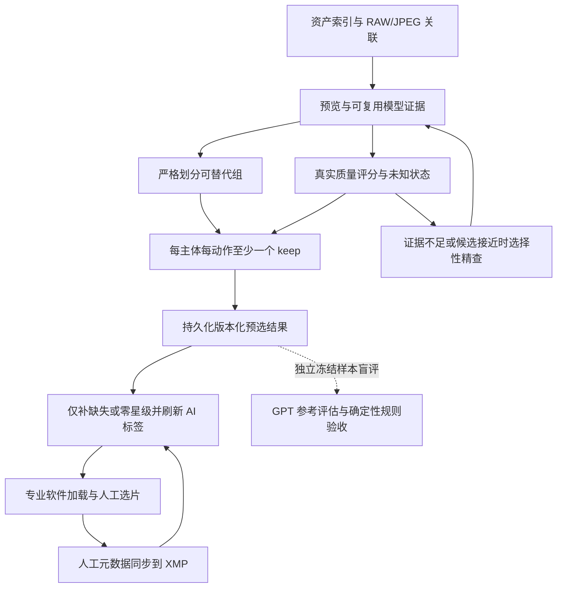

> 2026-09-16 更新：分组判定已由用户改为相邻时间连续 AND 哈希近似；哈希阈值 0 只看时间。本文 D02 中主体／动作可替代性、禁止相似链等旧判定要求不再是当前分组条件，详见 [新分组契约](../ai/modules/grouping.md)。

# material-agent：业务流程与技术选型决策记录

> 状态：D01–D08 产品方向已由项目负责人于 2026-09-14 确认；尚未实施。
> 本轮补充：XMP 字段缺失或 0 星均算未评分；非零评分保留。
> 外部资料检索：2026-09-11；Docker、专业软件互操作与 GPT 评估资料补查：2026-09-14。

本文承接流程评审与技术对标，记录最新用户决定、设计问题、建议实现规则与验收路径。依据是仓库契约、配置及官方公开资料；没有进行代码正确性审计、目标机器性能复测或商业产品实测。设计缺口不等于已确认的代码缺陷。

本轮仅更新决策材料并准备独立会话提示词，不修改应用代码、配置或照片元数据，不启动部署。本文中的“已确认”指产品方向；字段名、阈值和具体技术实现仍需对应实施阶段验证。与旧建议冲突时，以本轮用户决定为准；既有模块契约将在实施时同步更新，不能把目标行为当作已实现能力。

## 1. 五分钟审阅：已经决定什么

| 决策 | 已确认方向 | 实施时最重要的约束 |
| --- | --- | --- |
| [D01](#d01) | 自动预选 | 自动给出默认保留集合，人工在专业软件修正；不删除原片 |
| [D02](#d02) | 严格分组，每种主体/动作至少一个 keep | 宁可多留，避免不同菜品、动作互相淘汰；保底不抬高评分 |
| [D03](#d03) | 仅补未评分 XMP，AI 选片标签可重算 | 字段缺失或 0 星可写；已有非零评分不覆盖，包括旧 AI 评分 |
| [D04](#d04) | PS、Capture One 等专业软件为人工入口 | Web 负责任务、诊断、结果与交接；验证实际 Sidecar 往返 |
| [D05](#d05) | 证据门槛与选择性精查 | 未知、不适用、真实缺陷分开；背影/剪影不因看不到眼睛扣分 |
| [D06](#d06) | 先统一推理实现，再扩展多模型融合 | 先建立行为等价基线，再逐模型实验；独立会话执行 |
| [D07](#d07) | 保留单机架构，逐步改善 | SQLite 放持久化应用数据目录，和照片目录分离 |
| [D08](#d08) | 第一期由 GPT 辅助验收 | 不要求用户先标数据；区分 GPT 参考判断与人工真值 |

**目前没有必须继续回答的产品问题。** 下文给出可执行的默认规则；具体样本目录、可用 GPT 调用方式和资源预算，在执行评估时根据实际环境落实，不阻塞当前设计。

## 2. 从商业与开源项目借鉴什么

这些是官方公开工作流，不是准确率排名或内部算法调查。借鉴的是职责划分与交互语义，不能据此承诺本项目达到相同效果。

| 项目 | 公开做法 | 本项目采用的设计思路 |
| --- | --- | --- |
| [Aftershoot](https://support.aftershoot.com/en/articles/5223473-get-started-with-aftershoot-culling) | 自动/辅助选片，推荐、个人选择和 Maybe 分开 | 采用自动预选方向；技术问题与保留角色分开 |
| [Narrative](https://help.narrative.so/en/articles/11069214-narrative-quickstart-tutorial) | 场景比较、逐脸评估、局部放大、关键人物提示 | 关键区域证据与按需精查；检测到的人不自动等于主角 |
| [Imagen](https://support.imagen-ai.com/hc/en-us/articles/29925174097821-Review-your-photos-after-culling) | Keepers 与 Standalones 分开 | 独立照片不因没有竞争者而变成高分，但仍需覆盖保留 |
| [Imagen 往返流程](https://support.imagen-ai.com/hc/en-us/articles/17225669268253-Get-started-with-AI-culling) | 复核与外部工具交接 | 自动预选进入专业软件，避免重复建设完整选片工具 |
| [digiKam](https://docs.digikam.org/en/left_sidebar/labels_view.html) | 星级、Pick、颜色标签分离 | 质量分和 keep/reject 分开；不直接照搬所有标签 |
| [PhotoPrism](https://docs.photoprism.app/user-guide/organize/stacks/) | RAW/JPEG、版本与相关文件组成 Stack | 同次拍摄的文件表示单独建模，避免当作不同连拍候选 |
| [Immich](https://docs.immich.app/developer/architecture/) | 分阶段处理，模型服务与任务职责明确 | 复用预览、模型缓存与阶段产物；暂不复制完整多服务部署 |

## 3. 决策细则与验收

### D01：自动预选

系统自动生成可直接使用的 keep 集合，用户在专业软件中继续选片或精修。目标是减少重复比较，同时保住每个有独立记录价值的主体与动作。第一期不设全库固定保留张数；`reject` 表示本轮不优先进入预选集合，不触发物理删除。

**验收：**记录预选前后数量、不同主体/动作覆盖率、误排除参考保留照片数。没有实测人工操作时，不能把保留数量下降宣称为人工耗时下降。

### D02：严格分组、覆盖保留与诚实评分

**当前依据：**[分组契约](../ai/modules/grouping.md)采用时间切分和可选视觉合并；[配置](../../config.yaml)存在阈值及 `best_candidate_review`。这些不足以直接证明本轮所需的主体/动作覆盖保证已经成立。

目标设计分清三个对象：文件表示组（同次快门的 RAW/JPEG）、事件上下文（同一餐/景点）、可替代候选组（同主体、同动作且没有重要表达差异的重复拍摄）。只有最后一种组允许相互淘汰。

**已确认规则：**每个可替代组至少保留一张；不同菜品、不同动作分别保留。合并需要正向证据，不能只靠时间接近、背景相似或 embedding 相似。不能确定可替代时分开保留；避免通过相似链把首尾明显不同的照片串成一组。重要构图/视角差异默认也视为可能不可替代，这会多留一些照片，可在验收后调整。

| 场景 | 预选结果 | 评分结果 |
| --- | --- | --- |
| 十个菜，每菜一到五张 | 每个菜至少一张 keep，不是整桌仅一张 | 每张按质量证据评分 |
| 同一人同一场景，站立与跳跃 | 每个动作分别至少一张 keep | 不因动作独特加质量分 |
| 某菜所有照片都拍得不好 | 仍保留其中可读的最佳记录，注明保底与缺陷 | 可以是低星 keep |
| 只有一张可读照片 | 独立 keep | 不默认高分 |
| 一个组所有文件都无法解码 | 原文件保留，组标记错误待恢复，不能声称成功选出最佳 | 未评分，不把处理失败转成 reject |

“至少一张”不是“只能一张”。候选接近、组边界不确定或有互补价值时可以多留。极低分也不能让一个仍有可读照片的独立组全部退出 keep；覆盖规则优先于普通质量拒绝阈值。

**验收：**依据独立参考分组检查覆盖率，不能用算法自己生成的组证明自己没有漏菜。覆盖案例全部通过；同时报告过度拆组带来的多留率。分组变更可重排，但不改变已有像素证据或强行抬分。

### D03：XMP 星级只补空，AI 标签可覆盖

| XMP 当前值 | 本轮写出规则 |
| --- | --- |
| 文件不存在、Rating 字段缺失或明确为 0 | 可以填入本轮 AI 星级 |
| 已有 1–5 星，包括上次 AI 写入 | 保持原值 |
| 已有其他非零值，例如外部拒绝值 -1 | 保持原值，不映射成未评分 |
| 字段畸形或 XMP 无法可靠读取 | 停止该文件写出并报错，不按空白重建 |

用户将评分清为 0，意味着下一次运行允许 AI 重新填入。第一次 AI 写为非零后，后续重跑也不会刷新该星级；内部最新质量分仍可更新，因此“当前 AI 分”和“XMP 保留星级”可能不同，需能追溯，不应误报为同步失败。已有值不能自动归因为人工标注，更不能直接当个人偏好训练标签。

**标签投影建议（字段方案，尚未实施）：**在专业软件可见的 XMP `dc:subject` 中使用 `material-agent:keep` / `material-agent:reject` 两个互斥关键词；重跑只替换这两个精确归属本项目的关键词，保留其他人工关键词及未知字段。用户手改这两个 AI 关键词也可能被下次重算覆盖；持久人工标记应使用自己的关键词或外部软件标记。证据不足可先保守 keep 并另存复核原因，不能直接当作 reject。

当前 [XMP 契约](../ai/modules/xmp-writer.md)要求 `pj:*` 机器数据存于 `xmp:Identifier`，默认关键词只保留人工内容。上面的两个可见选片关键词是为满足新需求提出的窄范围调整，详细机器证据仍留在机器字段/数据库；实施时必须同步契约并验证专业软件可见性。

**验收：**缺失/0/1–5/-1、旧 AI 非零星、人工修改、畸形 XMP、并发外部修改、部分失败、重复写出、已有关键词、未知命名空间均覆盖。两次重跑星级保护一致，AI 标签随新结果更新，不清空其他元数据。评分写出与标签写出分别记录成功/跳过/失败。

### D04：专业软件作为人工入口

PS 相关链路按 Adobe Bridge / Camera Raw / Photoshop 实际使用方式验证；Capture One 单独验证。Web 负责配置、任务、模型、诊断和结果预览，第一期不建设完整 DAM 或重复的人工选片工作台。

[Capture One 官方文档](https://support.captureone.com/hc/en-us/articles/360002544898-Metadata-in-XMP-sidecar-files)说明 XMP 同步与同名 RAW/JPEG Sidecar 规则；[Adobe Camera Raw 设置文档](https://helpx.adobe.com/camera-raw/desktop/get-started/overview-and-setup/camera-raw-settings.html)说明设置存储方式。软件数据库/缓存、同步操作和文件命名均会影响实际行为，标准字段不等于各软件自动刷新或完全往返兼容。

**验收：**隔离样本执行 AI 写出→专业软件加载→人工改星/添加关键词→同步到文件→AI 重跑→重新加载。验证 keep/reject 能被筛选，人工非零星与其他关键词保留。同名 RAW/JPEG、`.xmp`/`.XMP`、不同步数据库状态都纳入用例。初期可显式触发同步，不假定自动监听已存在。

### D05：未知、不适用与背影/剪影

**已确认：**证据不足先保留未知；候选接近或关键区域信息不足时才精查更大预览、RAW 或提示人工查看。需要精查预算和触发原因，不能全量盲目升级解码成本。[现有评分契约](../ai/modules/scoring-engine.md)、[推理运行时](../ai/inference-runtime.md)作为迁移基线。

| 证据情况 | 眼睛/正脸指标 | 质量评价方式 |
| --- | --- | --- |
| 有可靠上下文表明是背影 | 不适用 `not_applicable` | 主体轮廓、姿态、主体清晰度、构图、环境关系 |
| 有可靠上下文表明是剪影 | 正脸、肤色、眼睛通常不适用 | 轮廓可读性、前后景分离、姿态、光影结构与构图；黑色主体本身不算曝光失败 |
| 只是检测器没有检出脸/眼睛 | 未知 `unknown` | 使用已有可靠证据，必要时精查；不推断为闭眼、背影或剪影 |
| 确实看到意外闭眼/失焦等 | 已观测缺陷 | 按相关场景记真实缺陷；刻意闭眼、运动表现仍需上下文 |

不适用的维度从该场景评分中排除，用已定义的场景评分规则处理；不能简单填满分或统一扣分。未知维度不伪造数值，另记录证据覆盖与不确定性；盲目重新归一化也不能让“证据越少分越高”。全部质量证据不可用时输出未评分/分析错误，不能用 0 冒充真实差评。

**背影/剪影不是免责标签。** 构图混乱、轮廓粘连、非刻意失焦仍可低分；其唯一记录仍可 keep。评分规则必须同时测“拍得好的背影/剪影”和“拍得差的背影/剪影”，避免只测是否不扣眼睛分。

### D06：先统一推理实现，再多模型融合

用户确定的顺序替代上一稿“先保留全部实现再逐项替换”的建议。第一阶段统一模型加载/编译、声明式预处理、批处理、缓存、结果与来源记录的实际执行路径；不能只添加统一接口而保留互相矛盾的隐藏行为。

原生 OpenVINO 为 Intel 加速方向，保留 CPU 回退；有明确平台/模型理由时使用 ONNX Runtime 适配，不强行迁移不支持的算子。先以当前支持模型验证行为等价、依赖和性能，再逐个增加候选并消融比较。NIMA 可继续作为审美证据基线，其分布离散度不能当成正确概率，分数线性校准也不会独自学会个人偏好。[NIMA 原理](https://www.research.google/blog/introducing-nima-neural-image-assessment/)

| 后续能力 | 候选，仅供实验 | 晋级依据 |
| --- | --- | --- |
| 主体/动作与可替代性 | [DINOv2](https://github.com/facebookresearch/dinov2)、[MobileCLIP2](https://github.com/apple/ml-mobileclip) | 独立事件上的错误合并和漏保留下降；不能仅凭相似分证明同动作 |
| 技术/感知质量 | [PyIQA](https://github.com/chaofengc/IQA-PyTorch/blob/main/docs/ModelCard.md) 中 TOPIQ_NR / MUSIQ 等单项对照 | 真实缺陷识别与保留参考改善，成本可接受 |
| 人脸/姿态细节 | [MediaPipe Face Landmarker](https://developers.google.com/edge/mediapipe/solutions/vision/face_landmarker) | 小脸、侧脸、遮挡与多人场景提供新增可靠证据 |
| 个人排名 | 简单排名器及 [LightGBM Ranker](https://lightgbm.readthedocs.io/en/latest/pythonapi/lightgbm.LGBMRanker.html) | 后续有明确个人偏好样本才启动；GPT 标签不能冒充个人偏好 |

实施前刷新 Python×平台×模型×运行时兼容矩阵，不能把 2026-09-11 的 [OpenVINO 要求](https://docs.openvino.ai/2026/about-openvino/release-notes-openvino/system-requirements.html)和 [ORT OpenVINO wheel](https://pypi.org/project/onnxruntime-openvino/)快照当永久事实。

**独立会话材料：**[统一推理实现 Prompt](2026-09-14-inference-unification-session-prompt.md)。该 Prompt 先执行第一阶段并产出第二阶段就绪报告，不在同一任务里无界引入全部候选。

### D07：SQLite 与 Docker 持久化

**可以把 SQLite 移出照片目标目录，建议这样设计。** 容器内使用固定应用数据路径，例如 `/appdata/state.sqlite`，由 Docker volume 或宿主机本地持久化目录挂载到 `/appdata`。这个路径是建议，不是当前配置字段或现有部署事实。

[Docker volumes](https://docs.docker.com/engine/storage/volumes/) 的数据生命周期独立于容器；容器自身可写层则随容器删除而消失。因此“放 Docker 自己里面”应实现为持久化挂载，不是只写镜像容器层。SQLite 的 [WAL 要求](https://sqlite.org/wal.html)意味着该挂载背后的文件系统仍须适合本地锁与共享内存；一个名为 volume 的 NFS/CIFS 挂载并不会自动变安全。

| 存储对象 | 目标位置与职责 |
| --- | --- |
| 原图与 XMP | 照片目录；分析读原图，独立写出流程更新 Sidecar |
| SQLite、迁移版本、写出记录 | 本地持久化 appdata；按库标识隔离，不依赖数据库恰好位于照片目录 |
| 模型与可重建缓存 | 有界缓存目录，可单独持久化；不能把数据库当缓存清理 |

迁移需要备份、兼容验证、稳定库/资产身份、恢复和回滚；移动挂载路径不能把全库误判为新照片。备份使用 SQLite 支持的一致性备份方式或停写检查点流程，不能在活跃 WAL 下只复制主 `.sqlite` 文件。

保留单机 worker，分步改善任务取消、恢复、幂等、缓存失效和 schema 迁移。[状态契约](../ai/modules/runtime-state.md)、[Web 契约](../ai/modules/web-operations.md)是当前依据。[FastAPI](https://fastapi.tiangolo.com/features/) + Uvicorn 仍是候选，尚未选定立即迁移；替换 Web 框架不能替代任务/状态设计。

**验收：**重建容器后结果和作业记录仍在；照片目录调整不重复建库；旧库可迁移；任务中断不把半成品标为完成；一致性备份可以恢复。第一期不引入外部数据库或分布式队列。

### D08：第一期由 GPT 辅助验收

接受用户安排：首期由代理使用 GPT 视觉判断组织验收，不以用户先投入人工标注为前置条件。这里是效果评估流程，不把远程 GPT 引入生产默认评分路径。

**建议执行方案：**

1. 建立小型冻结样本集，优先真实连续拍摄组，覆盖菜品、同场景多动作、独立照片、全组低质量、背影/剪影、多人、小脸、遮挡与失焦。公共标准集补充技术质量与审美，不假定它包含本项目所需的菜品/动作连续组；下载前确认官方来源和许可。
2. 初轮可从约 100–200 张、20–40 个候选组开始，作为发现设计错误的试验规模，不作为统计充分的生产准确率证明。先固定 rubric、参考组和测试清单，再看待测系统输出。
3. GPT 看照片与必要局部预览，独立给出主体/动作区分、可接受 keep 集合、成对偏好、可见缺陷和不确定项；评审时不展示生产分数/标签或候选模型身份。交换候选顺序复核部分样本，把分歧单列。
4. 调参与留出按拍摄事件隔离，同一 RAW/JPEG 或连拍不跨集合；保留模型版本、提示词、图像处理版本与判断记录。参考 [GroupKFold](https://scikit-learn.org/stable/modules/generated/sklearn.model_selection.GroupKFold.html) 的分组隔离思路。
5. 输出案例报告、覆盖/误拒/过度保留/排序指标及基线对照。确定性规则由程序验证，GPT 不负责凭感觉判定 XMP 字段是否被覆盖。

上述盲评、成对判断与重复检查方案借鉴 [OpenAI 评估最佳实践](https://developers.openai.com/api/docs/guides/evaluation-best-practices) 对评审偏差和明确评分标准的说明。具体采样规模与本项目验收规则是本稿建议，非官方推荐值。

**证据标签：**GPT 判断标记 `model_generated`；真实人工标注标记 `human_reference`；公共数据集记录自己的标注来源及许可。合成样本用于边界测试，不能替代真实拍摄效果证据。GPT 可提供第一期代理评审结论，但不等同于用户个人审美或对唯一纪念价值的确认。

[OpenAI 视觉文档](https://developers.openai.com/api/docs/guides/images-vision)列出图像缩放、错误描述及精确空间判断等限制。因此本项目不以小预览的 GPT 结论保证 RAW 微小失焦检出；必要时使用细节裁剪，仍不能判断则保留未知。

用户已允许从个人照片或公开数据准备验收。执行时先定位具体可访问样本与可用评审渠道，只取任务相关样本，记录送审范围；不把该授权扩大为整库持续外传。本轮尚未选取/上传照片、下载数据集或完成效果验收。

## 4. 问题台账：保留原编号并补充新增问题

P1 影响自动预选正确性或元数据；P2 影响工程可靠性与扩展。以下为契约事实、设计推论或待验证方案，不能当成已经复现的代码缺陷。

| 编号 | 优先级 | 问题 / 风险 | 优化与验收方向 |
| --- | --- | --- | --- |
| B01 | P1 | 时间/相似组不能保证菜品与动作独立 | D02：严格可替代性，独立参考覆盖验收 |
| B02 | P1 | `review` 混合质量阈值与保底含义 | D01/D02：keep 与质量分分离，低分可保底 |
| B03 | P1 | 主体检测不等于拍摄意图 | D05：未知/不适用分开，背影剪影正反例 |
| B04 | P1 | 旧写出契约未保证普通重跑保护所有非零星 | D03/D04：只补缺失/0，跨软件往返矩阵 |
| B05 | P1 | 路径随机划分可能导致连拍泄漏 | D08：事件级留出与冻结参考 |
| T01 | P1 | 通用审美/GPT 参考不等于个人偏好 | D06/D08：注明证据类型，暂不声称个性化 |
| T02 | P2 | 小预览不能支撑所有精细质量判断 | D05：精查触发、预算和未知状态 |
| T03 | P2 | 任务、结果、缓存、写出版本职责需清楚 | D03/D07：分阶段状态、幂等与一致性恢复 |
| T04 | P2 | Web 职责增长，需要重评 HTTP 入口 | D07：框架候选与 worker 职责分别验证 |
| T05 | P2 | 模型选型文档与 Intel 基线存在描述差异 | D06：盘点实际路径，统一实现并同步文档 |
| B06 | P1 | 仅检查算法自己的组会掩盖漏菜/漏动作 | D02/D08：独立参考语义单元覆盖，而非仅内部组非空 |
| B07 | P1 | 可见 AI 关键词与人工关键词所有权可能混淆 | D03：两个精确受管标签，其他关键词保留 |
| T06 | P1 | 把 SQLite 写进容器可写层或网络挂载会引入数据风险 | D07：本地持久化 appdata、迁移与恢复验收 |
| B08 | P1 | GPT 自我证明、顺序偏差或测试集反复调参 | D08：盲评、顺序复核、隔离留出与分歧报告 |

原始依据：[分组](../ai/modules/grouping.md)、[配置](../../config.yaml)、[XMP](../ai/modules/xmp-writer.md)、[状态](../ai/modules/runtime-state.md)、[Web](../ai/modules/web-operations.md)、[标签库](aesthetic-label-store.md)、[校准](aesthetic-target-calibration.md)、[模型选型](../ai/model-selection.md)、[Intel 配置](../../docker/config.intel-openvino.yaml)。

## 5. 目标流程与实施顺序

下图为已选择方向下的目标设计，不是当前代码调用图。

图中 J→H 表示后续显式重跑/写出再读取外部结果，不要求自动监听；F→B 受预算和终止条件控制。现有非零星级保护独立于 AI keep/reject 更新，不以旧星级强制推断新 AI keep。

| 顺序 | 交付 | 完成条件 |
| --- | --- | --- |
| 0：本轮设计记录 | 本文、独立推理 Prompt | D01–D08 与边界案例记录一致；无业务代码变更 |
| 1：推理实现统一，独立会话 | 实际生命周期、来源记录、缓存与兼容基线 | 当前模型行为等价，CPU 回退与兼容检查通过 |
| 2：自动预选闭环 | 严格分组、诚实评分、覆盖规则、XMP 投影；必要状态迁移 | 十菜/多动作不漏保留，非零星不覆盖，标签可筛选 |
| 3：GPT 首期验收 | 冻结样本、独立参考与盲评报告 | 确定性不变量全通过，代理质量指标与失败例公开可审阅 |
| 4：逐项多模型实验 | 候选矩阵、单模型与融合消融 | 相同留出集有收益，覆盖与元数据无回归，资源可接受 |

阶段 2 的规则设计与阶段 3 的样本准备可以和阶段 1 并行推进；必须先有基线与验收协议再据候选表现调策略。Docker 状态迁移可作为独立工程切片，保留迁移和回滚证据。

### 首期验收清单

| 项目 | 方法与通过口径 |
| --- | --- |
| 十菜/不同动作覆盖 | 固定参考场景中，每个有可读照片的语义单元至少一个 keep；全部通过 |
| 星级与元数据保护 | 缺失/0 可填，非零保持，受管标签更新，其他字段保留；全部通过 |
| 原片与处理失败 | 不删除或改写原片；解码失败不虚报评分或成功预选；全部通过 |
| 背影/剪影与未知 | 不因缺眼睛而扣分或强拒绝；真实缺陷仍能低分；所有边界案例通过 |
| 容器数据恢复 | 重建容器后状态仍在；一致性备份可恢复；全部通过 |
| GPT 参考误拒 | 报告被 AI reject 的参考 keep 数 / 参考 keep 总数；注明模型参考、分歧与样本量 |
| 参考覆盖与过度保留 | 报告语义单元覆盖率及 keep 占比；不为提高筛除率牺牲覆盖 |
| 组内选择质量 | 首选是否属于参考可接受集合，允许并列；对照冻结基线 |
| 性能与成本 | 冷/暖总耗时、内存、推理次数、精查率、GPT 调用量；先测量再定预算 |

质量指标先跑冻结基线，形成可审阅的数值门槛；门槛必须在候选正式比较前锁定，不事后迁就结果。不增加固定用例的漏保留/元数据损坏是硬约束，少量样本零错误仍不等于整体零风险。

## 6. 决定与待落实事项

**决定人 / 日期：**项目负责人，2026-09-14；本轮会话确认 D01–D08，随后明确“字段缺失或 0 星都算未评分”。本记录取代上一稿的未决状态，不代表应用已实现这些规则。

**无需再回答：**产品目标、分组保底、星级所有权、人工入口、未知证据策略、推理先后顺序、单机方向、首期 GPT 验收路径均已确认。

**实施时再落实：**样本来源目录及具体送审范围、可用模型调用渠道、专业软件实际同步配置、目标机器资源预算。代理先查当前环境和已有配置，只有确实缺失且影响执行时再询问。

**当前交付范围：**决策文档与可复制的独立会话 Prompt。模型融合、业务实现、数据库迁移、主照片库写出及效果验收尚未执行；不包含提交、发布或部署。
